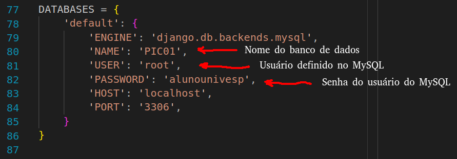

# Pi-Votorantim-2023


## Pré-Requisitos
---
* [Python >= 3.9](https://www.python.org/downloads/)
* [MySQL Server](https://dev.mysql.com/downloads/mysql/)

## Iniciando o projeto
---
Para baixar o repositório:  
`git clone https://github.com/Projeto-Integrador-Univesp-Votorantim/aplicacao-django.git`

Após baixar o repositório, usar o comando: `pip install -r requirements.txt`

*OBS: este comando irá instalar as dependências python (pacotes necessários) para a execução da aplicação* 

## Integrando com o banco de dados
--- 

Crie uma conexão local com as seguintes configurações:

<br>

Clone o repositório com o script para criação e preenchimento das tabelas:  
`git clone https://github.com/Projeto-Integrador-Univesp-Votorantim/banco_de_dados.git`


Aplique as migrations no projeto django:

``` bash
python manage.py makemigrations
python manage.py migrate
```

Para verificar os dados do BD:

``` python
python manage.py shell<br>
from pi.models import Habilidades<br>
Habilidades.objects.all()
```

Com isso, vemos que todos os dados do banco estão presentes

<hr>
